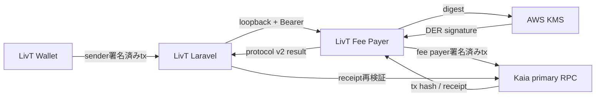

# LivT Fee Payer

LivT Fee Payerは、LivTのKaia Fee Delegationを担当するself-hosted serviceです。LivT Walletが作成したsender署名済みtransactionを厳格に検証し、Fee Payer署名を追加してKaiaへ送信します。

利用者のmnemonic、private key、Wallet password、LivT login credentialは受け取りません。MainnetのFee Payer keyもprocess内へ置かず、AWS KMSで署名します。

## Mainnet実証

2026年9月17日、Kaia Mainnetで1 JPYCのFee Delegated決済に成功しました。

| 項目 | 結果 |
|---|---|
| Network | Kaia Mainnet |
| Chain ID | `8217` |
| Amount | `1 JPYC` |
| SenderのKAIA残高 | `0 KAIA` |
| Fee Payer署名 | AWS KMS |
| Fee Payer gas cost | `0.00187957 KAIA` |
| Transaction | [`0xc045…9779`](https://kaiascan.io/ja/tx/0xc045b4894d6e6bbd4178422dc63bd36ecf5eee9478ad393cc1f150b942ef9779) |

これは単一Payment、単一sender、1 JPYC、制限されたgas budgetのpilotです。一般公開されたMainnet relayerではありません。

## なぜFee Payerが必要か

ERC-20 tokenを送るには通常native tokenでgasを支払う必要があります。JPYCだけを使いたい利用者にKAIA購入を要求すると、決済UXが複雑になります。

Kaia Fee Delegationでは役割を分離できます。

- 利用者はJPYC送金内容を自分のWalletで署名
- Fee Payerは内容を変更せず、gas支払い用の署名を追加
- gasはFee PayerがKAIAで負担

利用者鍵をcustodyせず、SenderのKAIAが0でもJPYC決済を実現できます。

## アーキテクチャ



LaravelがPayment、認証、allowlist、永続監査を担当し、Fee Payerはtransaction policy、Fee Payer署名、broadcast、receipt待機を担当します。secondary RPCはMainnet readiness用であり、broadcast failoverには使用しません。

## Fee Delegated Transaction

処理対象はKaiaの`FeeDelegatedSmartContractExecution`（transaction type `0x31`）です。

1. sender署名済みraw transactionを受信
2. type、chain ID、token、value、gas、calldata、sender signatureを検証
3. Mainnet pilot contextと残高policyを検証
4. Fee Payer signerで追加署名
5. 署名前後でsender fieldsが変わっていないことを再検証
6. 完全なtransactionからsenderをrecoverし一致確認
7. 送信直前にkill switchとPayment expiryを再確認
8. primary RPCへ1回だけbroadcast
9. 期待したtx hashとの一致を確認
10. receiptをpollし、successまたはrevertedを返す

実装はKaia serializerが返す`type="0x31"`と、zero valueを表す`value="0x"`を正しく受け入れます。不正なquantityは`INVALID_QUANTITY`として拒否します。

## AWS KMS

Mainnet signer backendはAWS KMSです。

- Mainnet private keyを`.env`やprocess memoryへ読み込まない
- hostのIAM role / instance identityでKMSへアクセス
- KMS public keyからFee Payer addressを導出
- DER形式の署名をEthereum/Kaia形式へ変換
- low-s正規化とrecovery検証
- 設定された公開addressとの一致をhealth checkで確認
- timeout、authentication failure、invalid signatureを固定diagnosticへ変換

具体的なKMS key ID、AWS credential、role情報はGitやREADMEへ保存しません。

## Transaction Policy

Fee Payerはsenderが署名した内容をそのまま信用しません。主な検査項目は次のとおりです。

- transaction typeが`0x31`
- Fee Payer署名がまだ存在しない
- network / chain IDがprofileと一致
- `to`が承認済みJPYC contract
- native `value`が0
- gas limitがservice上限以下
- calldataがERC-20 `transfer(address,uint256)`の正確な形式
- recipientとatomic amountが正しい
- sender signatureが1つで有効
- Fee Payer署名後もnonce、gas、to、value、from、data、sender signatureが不変
- Fee Payer addressとsignatureが正しい

Mainnet pilotではさらに検査します。

- Payment IDとexpiration
- exactly 1 JPYC (`10^18` atomic units)
- approved sender / merchant / Fee Payerが相互に異なる
- max gas / max gas price
- minimum reserve + 最大transaction fee
- maximum Fee Payer balance
- daily gas budget
- attempt count / rate window policy

## Broadcast Certainty Protocol v2

HTTP応答は`protocol_version=2`と`broadcast_certainty`を返します。

### `definitely_not_broadcast`

broadcast前に停止したことを証明できる状態です。例:

- sender transaction / pilot policy検証失敗
- kill switch、expiry、残高不足
- AWS KMS署名失敗
- Fee Payer署名済みtransactionの再検証失敗
- sender recovery失敗

現在のin-memory replay claimは、このcertaintyの場合だけ安全に解放します。KMS署名済みでもRPC broadcast前ならこの分類になり得るため、signing certaintyとは分離しています。

### `broadcast_possible`

broadcastされた可能性を否定できない状態です。例:

- `kaia_sendRawTransaction`のtransport failure
- malformed / error RPC response
- RPCが返したtx hashの不一致
- broadcast開始後、受理hash確定前の予期しない失敗
- 分類不能または壊れた内部certainty

この状態は自動再送せず、replay claimを保持します。

### `submitted`

RPCが期待したtransaction hashを返した後の状態です。receipt timeout、receipt hash mismatch、success、revertedはいずれも`submitted`です。receipt pollingは新しいtransactionを作らないため再試行できますが、broadcastは再試行しません。

protocol v2応答にはraw transaction、署名、RPC URL、credentialを含めません。

## Fail-closed設計

- 未分類の内部errorは`broadcast_possible`
- malformedなcertaintyも`broadcast_possible`
- broadcastを自動retryしない
- `broadcast_possible`と`submitted`のclaimを解放しない
- fully signed raw transactionをlogへ出さない
- 固定diagnostic codeだけをstderrへ出す
- API Bearerをtiming-safeに比較
- request body sizeを制限
- loopback `127.0.0.1`だけでlisten
- Mainnet local private key設定を拒否
- Mainnet primary/secondary RPCとKairos identityの混用を拒否

## Kill Switch / Mainnet Gates

Mainnet live pathには独立したgateがあります。

- Mainnet execution
- self-hosted Mainnet Fee Payer
- Mainnet signing
- Mainnet broadcast
- kill switch
- reviewed activation release capability

すべてが一致し、kill switchがinactiveで、signer・funding・pilot policyがreadyの場合だけlive serviceがsponsorshipを受け付けます。通常時はkill switchをactiveに保ちます。

activation manifestはoperatorが配置するlocal artifactで、意図的にGit管理外です。production buildはこのartifactを`dist/mainnet-pilot-activation.json`へcopyし、実行時にも同じrelease IDを検証します。repositoryには安全な形式例として`docs/mainnet-pilot-activation.example.json`だけを置いています。

## Read-only health server

`mainnet-staging-server`はread-only readinessとsigner healthを公開します。

- chain、JPYC contract、RPC、Fee Payer balanceを読み取り
- KMS public metadataのhealthを確認
- signing routeを持たない
- execution / signing / broadcastを`DISABLED`として報告
- kill switchを`ACTIVE`として報告
- 未入金でも照会可能なら`READ_ONLY_READY`と`NOT_FUNDED`を分離して報告

起動commandは次ですが、Mainnet設定を読み取るためoperator管理環境でのみ使用してください。

```bash
corepack pnpm start:mainnet-staging-health
```

## Live pilot server

`mainnet-live-pilot-server`は、reviewed release capabilityとすべてのruntime gateが揃った場合だけsponsorshipを受け付けます。起動時にもsecondary RPC、pilot policy、KMS health、reserve、maximum balanceを検査します。

これは常時起動を推奨する一般向けserverではありません。LivT側preflightとoperator approvalを完了し、限定したlive windowでのみ運用します。

## Funding policy

Mainnet readinessとexecution fundingは分離しています。

- read-only readiness: balanceを照会できればminimum reserve未満でも`NOT_FUNDED`として成功可能
- live preflight: `balance >= minimum reserve + max gas × observed gas price`が必要
- maximum balance: pilot用addressへ過剰なKAIAを置かない
- daily budget: 1日の想定gas支出を上限化
- gas / gas price: transaction単位でも上限化

具体値はoperatorがLaravel側policyと一致させます。READMEに実環境値やfunding先を記載しません。

## 技術スタック

- Node.js / TypeScript
- pnpm / Corepack
- viem
- `@kaiachain/viem-ext`
- AWS SDK for JavaScript v3 (`@aws-sdk/client-kms`)
- Node.js HTTP server / Web Crypto primitives
- Node.js built-in test runner

## セットアップ

```bash
corepack pnpm install
```

Kairos専用EOAを新規作成する開発用command:

```bash
corepack pnpm setup:kairos
```

既存`.env`がある場合は上書きしません。Mainnetではこのlocal private key経路を使用できません。

## Environment variables

実値は`.env`またはsecret managerで管理し、Gitへcommitしません。主な変数名:

### 共通 / Kairos

- `BLOCKCHAIN_NETWORK`
- `FEE_PAYER_API_KEY`
- `FEE_PAYER_KAIROS_PRIVATE_KEY`
- `FEE_PAYER_KAIROS_RPC_URL`
- `FEE_PAYER_PORT`
- `FEE_PAYER_MAX_GAS`
- `FEE_PAYER_RECEIPT_TIMEOUT_MS`
- `FEE_PAYER_KILL_SWITCH`
- `FEE_PAYER_MIN_RESERVE_KAIA`

### Mainnet signer / RPC

- `FEE_PAYER_KAIA_MAINNET_RPC_URL`
- `FEE_PAYER_KAIA_MAINNET_SECONDARY_RPC_URL`
- `FEE_PAYER_KAIA_MAINNET_ADDRESS`
- `FEE_PAYER_MAINNET_SIGNER_TYPE`
- `FEE_PAYER_MAINNET_SIGNER_BACKEND`
- `FEE_PAYER_AWS_REGION`
- `FEE_PAYER_AWS_KMS_KEY_ID`
- `FEE_PAYER_SIGNER_TIMEOUT_MS`

### Mainnet gates / pilot policy

- `FEE_PAYER_MAINNET_ENABLED`
- `SELF_HOSTED_MAINNET_FEE_PAYER_ENABLED`
- `FEE_PAYER_MAINNET_SIGNING_ENABLED`
- `FEE_PAYER_MAINNET_BROADCAST_ENABLED`
- `SELF_HOSTED_MAINNET_MAX_PAYMENT_JPYC`
- `SELF_HOSTED_MAINNET_MAX_GAS`
- `SELF_HOSTED_MAINNET_MAX_GAS_PRICE_WEI`
- `SELF_HOSTED_MAINNET_RATE_WINDOW_SECONDS`
- `SELF_HOSTED_MAINNET_MAX_ATTEMPTS_*`
- `SELF_HOSTED_MAINNET_DAILY_TRANSACTION_LIMIT`
- `SELF_HOSTED_MAINNET_DAILY_KAIA_BUDGET`
- `MAINNET_PILOT_MAX_FEE_PAYER_BALANCE_KAIA`
- `MAINNET_STAGING_MERCHANT_ADDRESS`
- `MAINNET_STAGING_APPROVED_SENDER_ADDRESSES`
- `MAINNET_PAYMENT_AUTHORIZATION_KEY`

AWS static credentialやMainnet private keyをこれらへ追加しないでください。
Payment認可鍵はLaravelとFee Payerだけに同じ32-byte hex値をsecret manager経由で配布し、Wallet、ログ、health responseへ値を出しません。

## Tests

unit testsはmock transport、fixture、offline signerを使い、Mainnet RPCやAWS KMSへ接続しません。

```bash
corepack pnpm test
corepack pnpm typecheck
corepack pnpm build
```

`pnpm test`は`tsconfig.json`でtest buildを行い、Node.js test runnerを実行します。production `pnpm build`はoperatorのactivation manifestを必要とし、`dist`へcopyします。

## Known limitations

- replay claimはPayment単位とsender transaction fingerprint単位だが、現在はprocess内のみ
- Laravel側attempt ledgerへcertaintyは永続化するが、Payment確定後の自動reconciliationは未完了
- Laravelのrate/budget上限は複数Payment対応後も保守的な値で運用する必要がある
- production monitoring、alerting、HA構成は未完成
- key rotation手順はoperator runbookのさらなる整備が必要

## Roadmap

- Laravelの永続replay claimとの統合
- receipt観測とPayment confirmed後のattempt state追従
- process再起動をまたぐFee Payer replay claim
- production monitoring / alerting / audit export
- KMS key rotationと障害復旧訓練
- rate limit、gas budget、funding policyの継続改善

## Related repositories

- `jpyc-web3-payment-platform`: LivT Laravel backend、Payment管理、最終検証
- `livt-wallet`: 利用者鍵の暗号化保存とsender署名を行うnon-custodial Wallet
